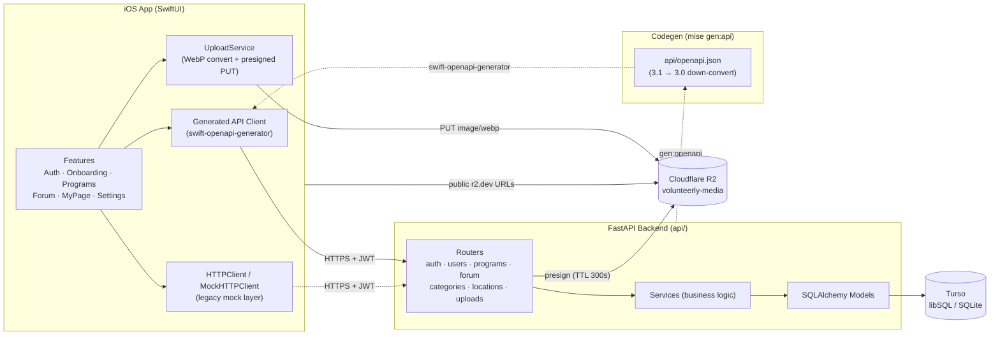
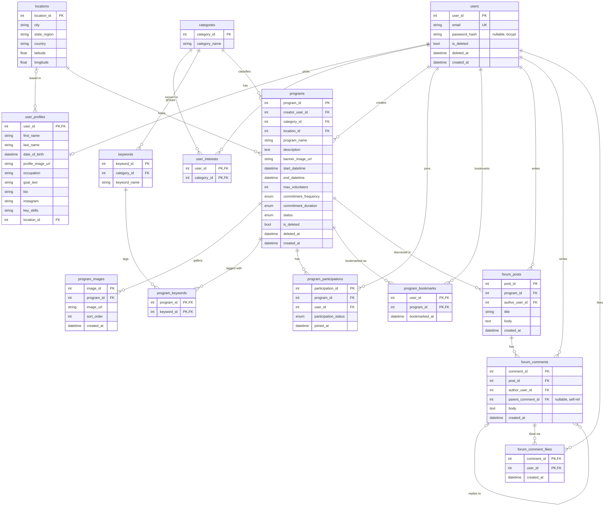

# Volunteerly

A volunteering platform: a SwiftUI iOS app backed by a FastAPI server, with
Turso (libSQL/SQLite) for data and Cloudflare R2 for media.

- `volunteerly/` + `volunteerly.xcodeproj` — SwiftUI iOS app
- `api/` — FastAPI backend (Python, uv, `mise` tasks)
- `api/openapi.json` — the API contract (OpenAPI 3.0), single source of truth for codegen

See [CLAUDE.md](CLAUDE.md) for build/run commands and repo conventions.

## Architecture

## ERD

Notes:

- `user_interests` references `categories` directly — interests and program
  categories are one taxonomy.
- `forum_comments.parent_comment_id` is a self-referential FK that drives the
  threaded conversation UI (`NULL` = top-level comment).
- `locations` has a case-insensitive unique index on
  `(city, state_region, country)` for find-or-create dedup.
- The iOS code uses `Forum*` naming even though the original ERD called these
  tables `BOARD_*` — keep "Forum" in iOS and API code.
